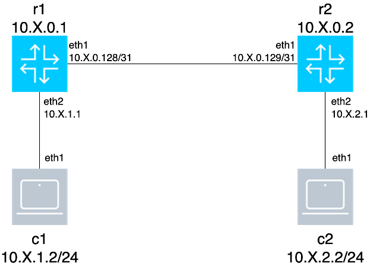
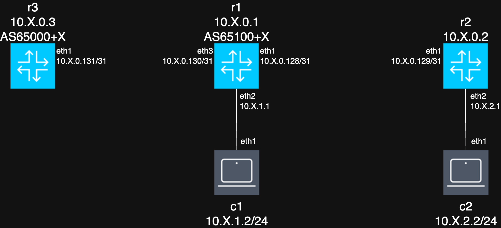
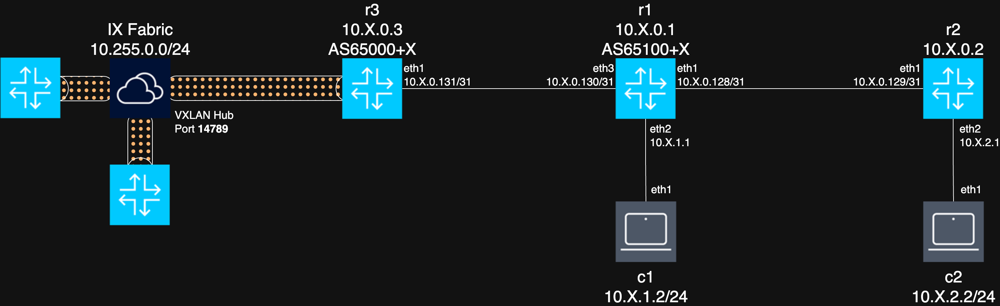

# RIPE91 Containerlab Workshop

## Prerequisites

To run this workshop, you should have at least 1-2 GB of RAM available on your Linux host, and should run kernel 5.4 or newer.
Recommended distributions are: Ubuntu (20.04), Debian (11), Fedora (32), CentOS (9) or derivatives, or newer.

The workshop can be ran on x86 or ARM64-based systems.

## Installing Containerlab

This one-liner will install Containerlab and dependencies (including Docker):

```
curl -sL https://containerlab.dev/setup | sudo -E bash -s "all"
```

If you wish to install Containerlab yourself, please make sure the following pre-requisites are present on the system:

- A working container runtime (Docker recommended!)
- git

After installation with the one-liner, a group called `clab_admins` will also be created. If you would like to use Containerlab without sudo, you should add your user to this group using the following command: `gpasswd -a <your username here> clab_admins` and apply the new group membership to your terminal session using the `newgrp clab_admins` command.

Upon successful installation, `containerlab version` should give you a nice output.

The workshop requires Containerlab 0.69.4 (release pending at the time of writing) or newer.

## Task -1: Testing Containerlab

In order to test your Containerlab topology, you should deploy a "hello world" topology example and test if traffic passes between two nodes.

```
clab deploy –t https://github.com/vista-/clab-helloworld
```

Once deployed, you should be able to ping from `host1` to `host2`.

```
$ docker exec clab-helloworld-host1 ping 10.0.0.2
PING 10.0.0.2 (10.0.0.2): 56 data bytes
64 bytes from 10.0.0.2: seq=0 ttl=64 time=1.037 ms
```

## Task 0: Deploying the topology

The workshop topology consists of two FRR routers and two clients.



The credentials for the nodes are the following:
- FRR: Use `docker exec -it <nodename> vtysh` to enter the FRR shell
- Clients: SSH to `<nodename>` using admin/multit00l credentials 

Each participant will have a numeric ID assigned to them, this will be used to form IP prefixes and addresses, and later AS numbers.

The network used in the topology is 10.**X**.0.0/16, where **X** is the participant's numeric ID.

The topology image shows the addressing, but this is reproduced here for brevity:
- `r1` loopback: 10.**X**.0.1/32, client addressing 10.**X**.1.0/24
- `r2` loopback: 10.**X**.0.2/32, client addressing 10.**X**.2.0/24
- `r1`-`r2` link: 10.**X**.0.128/31

**Before deploying the topology**, make sure to run the `export ID=<your ID here>; ./prepare.sh` command to prepare the configuration files for use!

Use the `clab deploy` command to deploy the topology.

To test the deployed topology, you can run the `docker exec clab-ripeworkshop-c2 ping 10.X.2.1` command, where X is your ID. This ping should work!

## Task 1: Getting your routers in order

`r2` and `c2` are preconfigured with addressing, and `r2` also has OSPF pre-configured.

Let's configure `r1` and `c1`!
- `r1` interface addressing:
  * `eth1`: 10.**X**.0.128/31
  * `eth2`: 10.**X**.1.1/24
  * `lo`: 10.**X**.0.1/32
- `c1` interface addressing:
  * `eth1`: 10.**X**.1.2/24
  * Static route 10.0.0.0/8 via 10.**X**.1.1
- `r1` OSPF:
  * Router ID should be the loopback address
  * Only area 0
  * `eth1` as a P2P interface
  * The rest of the interfaces should be passive!

To verify your configuration, you should check the routing tables on `r1` and verify that the route 10.**X**.2.0/24 is visible and reachable, and that the client `c1` can ping `c2` without an issue.

```
r1# show ip route ospf
...
O   10.X.0.1/32 [110/0] is directly connected, lo, weight 1, 01:12:06
O>* 10.X.0.2/32 [110/10] via 10.X.0.129, eth1, weight 1, 01:11:51
O   10.X.0.128/31 [110/10] is directly connected, eth1, weight 1, 01:12:06
O   10.X.1.0/24 [110/10] is directly connected, eth2, weight 1, 01:12:06
O>* 10.X.2.0/24 [110/20] via 10.X.0.129, eth1, weight 1, 01:11:51

[*]─[c1]─[~]
└──> ping 10.X.2.2
PING 10.X.2.2 (10.X.2.2) 56(84) bytes of data.
64 bytes from 10.X.2.2: icmp_seq=1 ttl=63 time=2.32 ms
```

## Task 2: Expanding the topology

We are going to expand the topology a bit by adding `r3`, yet another FRR router.



Before we do anything though, let's save our progress! Use the `write` command on `r1`. You should see `config/r1.conf` change on the disk, as it is mounted read-write.
It might be owned by `root` now, so just `chown username:username ./config/r1.conf` it back!

Normally, with regular NOSes where Containerlab can pass a startup-config, the `containerlab save` command could do this for us, but not for FRR today.

We can then destroy the Containerlab topology with `containerlab destroy`.

In the topology, make sure to also add the missing config for client `c1`.
Then, add `r3` by copying one of the router nodes and changing the appropriate values.
After that's done, create a link between `r3` and `r1` according to the topology diagram in the topology file.

Finally, to create `r3`'s configuration, just `cp ./config/r1.conf ./config/r3.conf`, and delete the OSPF configuration and change the interface addressing for the P2P link in `r3.conf`, and add the new interface to `r1.conf`.
You don't have to spin up the nodes to manually change the configuration files!

To verify our work, deploy the topology and verify that `r3` is now in the list of nodes. If we did the interface configurations correctly, we should be able to ping `r3` from `r1`.

```
$ clab deploy
│ ...             │ ...                                │ ...     │ ...            │
├─────────────────┼────────────────────────────────────┼─────────┼────────────────┤
│ clab-ripelab-r3 │ linux                              │ running │ 172.20.20.5    │
│                 │ quay.io/frrouting/frr:10.2.3       │         │ N/A            │
╰─────────────────┴────────────────────────────────────┴─────────┴────────────────╯

r3# ping 10.X.0.130
PING 10.X.0.130 (10.X.0.130): 56 data bytes
64 bytes from 10.X.0.130: seq=0 ttl=64 time=0.976 ms
```

## Task 3: Adding BGP to the mix

`r3` and `r1` should have eBGP running between the two routers.

`r3` is AS65000+**X**. `r1` is AS65100+**X**. Don't touch the OSPF routing configuration for now, though!
Redistribute the OSPF routes into the BGP instance on `r1`.

Hint: `no bgp ebgp-requires-policy` gets you out of having to write routing policies.

An optional task: Only advertise an aggregate route 10.**X**.0.0/16 from `r1` to `r3` via BGP!

To verify the BGP routing, we can check the BGP neighbors and route tables on `r3`:

```
r3# show bgp sum
...
Neighbor         V         AS   MsgRcvd   MsgSent   TblVer  InQ OutQ  Up/Down State/PfxRcd   PfxSnt Desc
10.X.0.130       4      65100+X      40        32       26    0    0 00:19:53            2        2 N/A

r3# show bgp ipv4
...
    Network      Next Hop            Metric LocPrf Weight Path
*>  10.X.0.0/16  10.X.0.130               0             0 65100+X ?
```

## Task 4: Connecting to an "IX"

We will be using one of Containerlab's many built-in tools to interconnect your topology with other participants' networks!

First of all, make sure all your work is **saved**! `r1` and `r3` will need their configurations saved. Don't forget to reset the file ownership on these two files.

We are going to add an external-facing interface in the topology:
Add a new endpoint to the topology: `- endpoints: [r3:eth2, host:r3-ext]`

The `host` bit tells Containerlab that this interface should be created on the Containerlab host.

Let's re-deploy the lab again! After the deployment is done, the r3-ext interface should be visible on the host:
```
$ ip link show dev r3-ext
13: r3-ext@if12: <BROADCAST,MULTICAST,UP,LOWER_UP> mtu 9500 qdisc noqueue state UP mode DEFAULT group default
    link/ether aa:c1:ab:62:f8:35 brd ff:ff:ff:ff:ff:ff link-netnsid 4
```

To connect this device to the "IX", we will using the Containerlab command to bind the interface to a VXLAN tunnel:

```
containerlab tools vxlan create --remote <VXLAN hub address> --id <VNI> --link r3-ext --src-port 14789 --port 14789
```

The VXLAN Hub's IP address and the VNI will be provided during the workshop. The VXLAN hub the tunnel connects to is a custom-written VXLAN switch implementation, which can be found here: https://github.com/vista-/vxlan-hub
Note that we don't use the default VXLAN port, 4789, as it is blocked by many cloud providers.



Finally, we can start configuring things!

The "IX" LAN is 10.255.0.0/24, and each "IX" participants' "IX"-facing interface is numbered as 10.255.0.**X**. The ASN used on the "IX" is the one used on `r3`, so AS65000+**X**.

There is a route server running on 10.255.0.254, with AS65000.

Your task is to set up BGP peering with both the "IX" route server and set up bilateral sessions with other participants as well, and successfully ping their `c2` clients!

Hint1: Make sure you can ping the "IX" route server before doing any further configuration.
Hint2: By default, FRR only accepts the remote AS as the first AS in the path, there's a knob to adjust this.
Hint3: You might need to redistribute routes on `r1` from BGP into OSPF in order to successfully route through to `r2`, through which `c2` is connected.

If you feel the need to redeploy, make sure to do `containerlab tools vxlan destroy` before destroying the lab!

To verify your work, check out BGP sessions, route tables, and pings to others' `c2` clients:

```
r3# show bgp sum
Neighbor        V         AS   MsgRcvd   MsgSent   TblVer  InQ OutQ  Up/Down State/PfxRcd   PfxSnt Desc
10.X.0.130      4      65100+X     181       187       28    0    0 02:47:39            2        4 N/A
10.255.0.254    4      65000        19        19       28    0    0 00:23:18            2        4 N/A

r3# show bgp ipv4
...
     Network          Next Hop            Metric LocPrf Weight Path
*>   10.X.0.0/16      10.X.0.130                0            0 65100+X ?
*>   10.Y.0.0/16      10.255.0.Y                             0 65000+Y 65100+Y ?


r3# show bgp ipv4 unicast neighbors 10.255.0.254 received-routes
... 
*> 10.X.0.0/16      10.255.0.X                             0 65000+X 65100+X ?
*> 10.Y.0.0/16      10.255.0.Y                             0 65000+Y 65100+Y ?

[*]─[c2]─[~]
└──> ping 10.Y.2.2
PING 10.Y.2.2 (10.Y.2.2): 56 data bytes
64 bytes from 10.Y.2.2: seq=0 ttl=61 time=27.085 ms
```

## Task 5: Experiment!

Feel free to try out other things while the workshop is still open! Please make sure to save your progress and copy your topology in case you are using a VM provided by the organizer.

## Teardown

To tear down the lab, first destroy the VXLAN tunnel (if you created one at this point):
```
containerlab tools vxlan destroy
```

You can destroy the lab by using the `containerlab destroy command`.

## Solutions

If you get stuck, or need to quickly catch up to the next task, you can find the solved topology and configs under the `.solved` directory, one for each task.
